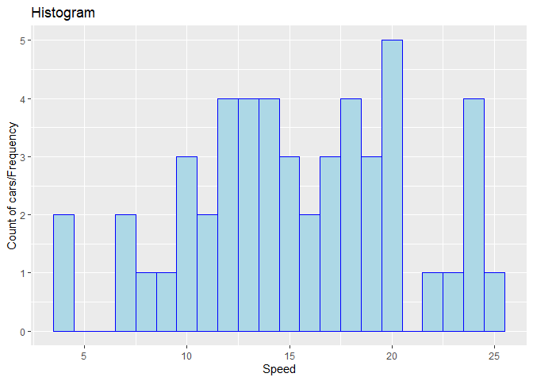
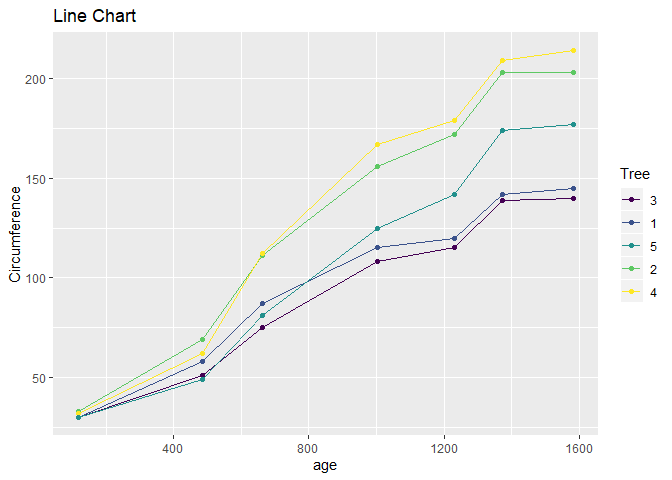

Visualization with ggplot2
================
By: Anjali Gautam

Below are codes to create basic visualizations in R package ggplot2.
This is for someone who wants to start with ggplot2 or use it for basic
purposes. I will use R datasets to create these visualizations and will
update the code as new visualizations are discovered

``` r
library(ggplot2)
```

#### Histogram

R data “cars” will be used for this plot

``` r
data("cars")
str(cars)
```

    ## 'data.frame':    50 obs. of  2 variables:
    ##  $ speed: num  4 4 7 7 8 9 10 10 10 11 ...
    ##  $ dist : num  2 10 4 22 16 10 18 26 34 17 ...

``` r
ggplot(cars,aes(speed))+
  geom_histogram(binwidth = 1, fill="lightblue", color = "blue")+
  labs(x="Speed", y = "Count of cars/Frequency")+
  ggtitle("Histogram")
```

<!-- -->

#### Line chart

R data “Orange” will be used for this plot

``` r
data("Orange")
```

I will plot weight of chicks with time

``` r
ggplot(data= Orange, aes(x=age, y = circumference, color=Tree))+
  geom_line()+
  geom_point()+
  labs(y="Circumference")+
  ggtitle("Line Chart")
```

<!-- -->
